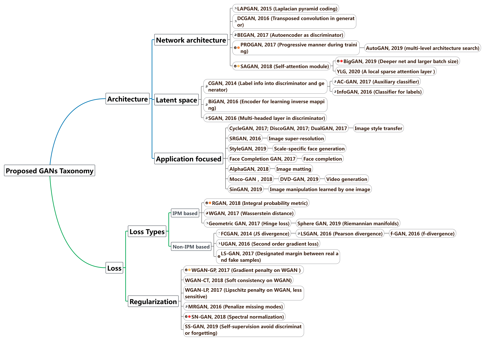

This repo contains GANs review for topics of computer vision and time series
=======

## News 
[2021/07/11] Our preprint ["Generative Adversarial Networks in Time Series: A Survey and Taxonomy", Eoin Brophy and Zhengwei Wang and Qi She and Tomas E. Ward](https://arxiv.org/pdf/2107.11098.pdf) is out. This work is currently in progress.

[2021/02/14] Our paper [“Generative Adversarial Networks in Computer Vision: A Survey and Taxonomy” Zhengwei Wang and Qi She and Tomas E. Ward](https://dl.acm.org/doi/abs/10.1145/3439723) ([arxiv version](https://arxiv.org/pdf/1906.01529.pdf)) has been published at **ACM Computing Surveys**，and we will continue to polish this work into the 5th version. Details of selected papers and codes can refer to [GAN_CV folder](https://github.com/sheqi/GAN_Review/tree/master/GAN_CV).

[2020/11/24] Our paper [“Generative Adversarial Networks in Computer Vision: A Survey and Taxonomy” Zhengwei Wang and Qi She and Tomas E. Ward](https://arxiv.org/pdf/1906.01529.pdf) gets acceptted into **ACM Computing Surveys**，and we will continue to polish this work into the 5th version.

[2020/06/20] We have updated our **4th** version of GAN survey for **computer vision** paper ! It inlcudes more recent GANs proposed at CVPR, ICCV 2019/2020, more intuitive visualization of GAN Taxonomy.

[2020/10/04] GANs related to our latest paper will be updated shortly. 

# Generative Adversarial Networks in Computer Vision

</img>

A Survey and Taxonomy of the Recent GANs Development in computer vision. Please refer to the details in recent review paper [“Generative Adversarial Networks in Computer Vision: A Survey and Taxonomy” Zhengwei Wang and Qi She and Tomas E. Ward](https://dl.acm.org/doi/abs/10.1145/3439723) ([arxiv version](https://arxiv.org/pdf/1906.01529.pdf)). We also provide a list of papers related to GANs on computer vision in the GAN_CV.csv file.

If you find this useful in your research, please consider citing:

    @article{wang2021generative,
      title={Generative Adversarial Networks in Computer Vision: A Survey and Taxonomy},
      author={Wang, Zhengwei and She, Qi and Ward, Tomas E},
      journal={ACM Computing Surveys (CSUR)},
      volume={54},
      number={2},
      pages={1--38},
      year={2021},
      publisher={ACM New York, NY, USA}
    }

We have classified the two GAN-variants research lines based on recent GAN developments, below we provide a summary and the demo code of these models. We have tested the codes below and tried to summary some of <b>lightweight</b> and <b>easy-to-reuse</b> module of state-of-the-art GANs.

## Architecture-variant GANs
LAPGAN:  
https://github.com/jimfleming/LAPGAN (TensorFlow)  
https://github.com/AaronYALai/Generative_Adversarial_Networks_PyTorch (PyTorch)

DCGAN:   
https://github.com/carpedm20/DCGAN-tensorflow (TensorFlow)  
https://github.com/last-one/DCGAN-Pytorch (PyTorch)

BEGAN:  
https://github.com/carpedm20/BEGAN-tensorflow (TensorFlow)  
https://github.com/anantzoid/BEGAN-pytorch (PyTorch)

PROGAN:  
https://github.com/tkarras/progressive_growing_of_gans (TensorFlow)  
https://github.com/nashory/pggan-pytorch (PyTorch)

SAGAN:  
https://github.com/brain-research/self-attention-gan (TensorFlow)   
https://github.com/heykeetae/Self-Attention-GAN (PyTorch)

BigGAN:    
https://github.com/taki0112/BigGAN-Tensorflow (TensorFlow)  
https://github.com/ajbrock/BigGAN-PyTorch (PyTorch)

Your Local GAN:  
https://github.com/giannisdaras/ylg (TensorFlow)  
https://github.com/188zzoon/Your-Local-GAN (PyTorch)

AutoGAN:  
https://github.com/VITA-Group/AutoGAN (PyTorch)

MSG-GAN:  
https://github.com/akanimax/msg-stylegan-tf (TensorFlow)  
https://github.com/akanimax/msg-gan-v1 (PyTorch)

## Loss-variant GANs
WGAN:  
https://github.com/ChengBinJin/WGAN-TensorFlow (TensorFlow)   
https://github.com/Zeleni9/pytorch-wgan (PyTorch)

WGAN-GP:  
https://github.com/changwoolee/WGAN-GP-tensorflow (TensorFlow)   
https://github.com/caogang/wgan-gp (PyTorch)

LSGAN:  
https://github.com/xudonmao/LSGAN (TensorFlow)  
https://github.com/meliketoy/LSGAN.pytorch (PyTorch)

f-GAN:  
https://github.com/LynnHo/f-GAN-Tensorflow (TensorFlow)

UGAN:  
https://github.com/gokul-uf/TF-Unrolled-GAN (TensorFlow)   
https://github.com/andrewliao11/unrolled-gans (PyTorch)

LS-GAN:  
https://github.com/maple-research-lab/lsgan-gp-alt (TensorFlow)  
https://github.com/maple-research-lab/glsgan-gp (PyTorch)

MRGAN:  
https://github.com/wiseodd/generative-models/tree/master/GAN/mode_regularized_gan (TensorFlow and PyTorch) 

Geometric GAN:  
https://github.com/lim0606/pytorch-geometric-gan (PyTorch) 

RGAN:  
https://github.com/AlexiaJM/RelativisticGAN (TensorFlow and PyTorch)

SN-GAN:  
https://github.com/taki0112/Spectral_Normalization-Tensorflow (TensorFlow) 
https://github.com/christiancosgrove/pytorch-spectral-normalization-gan (PyTorch)

RealnessGAN:  
https://github.com/taki0112/RealnessGAN-Tensorflow (TensorFlow)  
https://github.com/kam1107/RealnessGAN (PyTorch)

Sphere GAN:  
https://github.com/taki0112/SphereGAN-Tensorflow (TensorFlow)  
https://github.com/Dotori-HJ/SphereGAN-Pytorch-implementation (PyTorch)

Self-supervised GAN:  
https://github.com/zhangqianhui/Self-Supervised-GANs (TensorFlow)  
https://github.com/vandit15/Self-Supervised-Gans-Pytorch (PyTorch)

# GAN Review for Time Series
A Survey and Taxonomy of the Recent GANs Development in time series. Please refer to the details in recent review paper ["Generative Adversarial Networks in Time Series: A Survey and Taxonomy", Eoin Brophy and Zhengwei Wang and Qi She and Tomas E. Ward](https://arxiv.org/pdf/2107.11098.pdf). This work is currently in progress.

If you find this useful in your research, please consider citing:

	@article{brophy2021generative,
	  title={Generative adversarial networks in time series: A survey and taxonomy},
	  author={Brophy, Eoin and Wang, Zhengwei and She, Qi and Ward, Tomas},
	  journal={arXiv preprint arXiv:2107.11098},
	  year={2021}
	}

## Datasets
Unlike computer vision having lots of well-known and large-scale benchmarking datasets, time series benchmarking datasets are limited due to generalization and some privacy issues especially for clinical data. Below we provide some resources of well-known time series datasets. Hopefully it is useful. **Feel free to suggest any well-known time series datasets to this repo by opening new issue**. We will review it and add it to the list! We hope this can help push the time series research forward!

* [Oxford-Man Institute realised library (Updated Daily)](https://realized.oxford-man.ox.ac.uk/). Real Multivariate Time Series dataset contains 2,689,487 instances and 5 attributes.
* [EEG Motor Movement/Imagery Dataset (2004) ](https://physionet.org/content/eegmmidb/1.0.0/). Real Multivariate Time Series contains 1,500 instances and 64  attributes.
* [ECG 200 (2001)](http://www.timeseriesclassification.com/description.php?Dataset=ECG200). Real Univariate Time Series contains 200 instance and 1 attribute. 
* [Epileptic  Seizure  Recognition  Dataset (2001)](https://archive.ics.uci.edu/ml/datasets/Epileptic+Seizure+Recognition). Real Multivariate Time Series dataset contains 11,500 instances and 179 attributes.
* [TwoLeadECG (2015)](http://www.timeseriesclassification.com/description.php?Dataset=TwoLeadECG). Real Multivariate Time Series dataset contains 1,162 instances and 2 attributes.
* [MIMIC-III Clinical Database (2016)](https://physionet.org/content/mimiciii/1.4/). Real, Integer & Categorical Multivariate Time Series.
* [MIMIC-III Clinical Database Demo (2019)](https://physionet.org/content/mimiciii-demo/1.4/). Real, Integer & Categorical Multivariate Time Series.
* [EPILEPSIAE project database](http://www.epilepsiae.eu/project_outputs/european_database_on_epilepsy). Real Multivariate Time Series dataset contains 30 instances.
* [PhysioNet/CinC](https://physionet.org/news/post/231). Lots of clinical data for challenging competition.
* [Wrist PPG During Exercise (2017)](https://physionet.org/content/wrist/1.0.0/). Real Multivariate Time Series dataset contains 19 instances and 14 attributes.
* [MIT-BIH Arrhythmia Database (2001)](https://physionet.org/content/mitdb/1.0.0/).  Real Multivariate Time Series dataset contains 201 instances and 2 attributes.
* [KDD Cup Dataset](https://kdd.org/kdd-cup). Lots of Real, Integer & Categorical  Multivariate Time Series datasets.
* [PeMS Database (updated daily)](https://dot.ca.gov/programs/traffic-operations/mpr/pems-source). Real, Integer & Categorical  Multivariate Time Series datasets.
* [Nottingham Music Database](http://abc.sourceforge.net/NMD/). Special Text Format Time Series. 

## Discrete-variant GANs
* [SeqGAN](https://arxiv.org/pdf/1609.05473.pdf): [TensorFlow](https://github.com/LantaoYu/SeqGAN); [PyTorch](https://github.com/suragnair/seqGAN)
* [ Quant GAN](https://arxiv.org/pdf/1907.06673.pdf): Code to be added

## Continuous-variant GANs
* [C-RNN-GAN](https://arxiv.org/pdf/1611.09904.pdf): [TensorFlow](https://github.com/olofmogren/c-rnn-gan); [PyTorch](https://github.com/cjbayron/c-rnn-gan.pytorch)
* [RCGAN](https://arxiv.org/pdf/1706.02633.pdf): [TensorFlow](https://github.com/ratschlab/RGAN)
* [SC-GAN](https://www.springerprofessional.de/en/continuous-patient-centric-sequence-generation-via-sequentially-/16671112): Code to be added
* [NR-GAN](https://dl.acm.org/doi/abs/10.1145/3366174.3366186): Code to be added
* [Time GAN](https://papers.nips.cc/paper/2019/file/c9efe5f26cd17ba6216bbe2a7d26d490-Paper.pdf): [TensorFlow](https://github.com/jsyoon0823/TimeGAN)
* [SigCWGAN](https://arxiv.org/pdf/2006.05421.pdf): [PyTorch](https://github.com/SigCGANs/Conditional-Sig-Wasserstein-GANs)
* [DAT-CGAN](https://arxiv.org/pdf/2009.12682.pdf): Code to be added
* [SynSigGAN](https://www.mdpi.com/2079-7737/9/12/441): Code to be added
 
